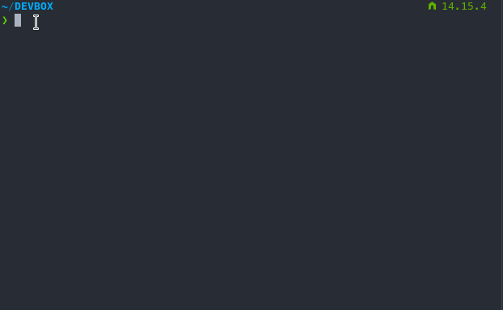
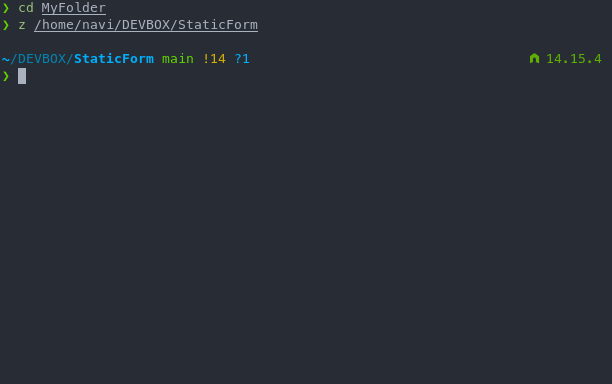

# Static Form

[](https://app.netlify.com/sites/staticform21/deploys)

Static Form is a form builder, like Google Form, that built on JAMStack aka static website.


Sounds like a google form ripoff, but it has some benefits:

1. Hackable front end - both on admin and user side -, hackable form API end point, hackable data processing.
2. Fast! Near 100 Google Lighthouse test.
3. Zero cost, but you probably waste your time due to hacking happy

On the front end side it uses Eleventy static site generator, Netlify CMS for the admin panel, and Tailwind CSS.

No complicated build tools, just using PostCSS CLI and Eleventy. HTML and JS minifier are included in Eleventy build process.

On the back end, well.. There is no back end.

Actually netlify provide the back end, which is the static site hosting, form API end point and authentication.

Static Form is configured to work with WhatsApp API and Netlify Form as endpoint so you don't really have to bake your own API endpoint.


## Usage

Static Form demo is live [here](staticform21.netlify.app). You can also try login and make a draft of form in the [admin interface](staticform21.netlify.app/admin) with Github account.


## Installation

TLDR;

```
git clone https://github.com/zulvkr/StaticForm.git
cd StaticForm
npm install
npm run start
```

or click this button:

[](https://app.netlify.com/start/deploy?repository=https://github.com/zulvkr/StaticForm&stack=cms)

Netlify will fork this repository on your account, build it and setup CI/CD automagically.


### Prerequisites

1. `git` should be installed
2. Node JS
3. A good Unix-like terminal/command line. If you use Windows, I suggest to try [CMDER](https://cmder.net/).


### Step by step installation

1. Fire up your terminal 🔥
2. Move to directory where you want to install **Static Form** with `cd` command.

    

    tips: you can use `tab` to autocomplete terminal command or double `tab` for suggestion.

3. Clone this project from Github to your local system


    ```
    git clone https://github.com/zulvkr/StaticForm.git
    ```

4. `cd` to the project folder

    ```
    cd StaticForm
    ```

5. Install dependencies

    ```
    npm install
    ```

    This command will install all dependecies of this project in *node_modules* directory. You can see all dependecies of this project in *package.json*.

6. You can start the development server by running

    ```
    npm run start
    ```

    
    
    Open *localhost:8080* in your browser to see if the server running properly